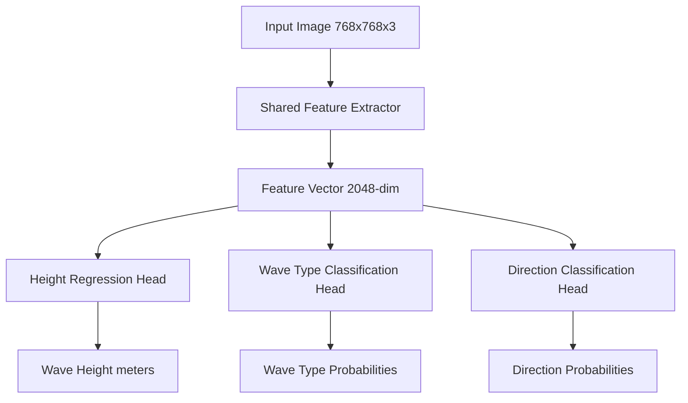

# Design Document: SwellSight Wave Analysis Model

## Overview

The SwellSight Wave Analysis Model is a multi-task deep learning system that extracts objective physical wave parameters from beach camera images. The system uses a shared backbone architecture with specialized task heads to simultaneously predict wave height (regression), breaking type (classification), and wave direction (classification). The model is trained primarily on synthetic data generated from depth maps and validated on real-world beach images.

## Architecture

### High-Level Architecture



### Model Components

**Shared Feature Extractor (Backbone)**
- Architecture: ConvNeXt-Base (chosen for optimal balance of performance and efficiency)
- Input: RGB images resized to 768x768 pixels
- Output: 2048-dimensional feature vector
- Pre-trained: ImageNet-1K weights for initialization
- Rationale: Research shows ConvNeXt matches Transformer performance with lower computational demands and performs well on diverse computer vision tasks

**Task-Specific Heads**
1. **Height Regression Head**: 2-layer MLP (2048 → 512 → 1) with ReLU activation
2. **Wave Type Head**: 2-layer MLP (2048 → 512 → 4) with softmax output
3. **Direction Head**: 2-layer MLP (2048 → 512 → 3) with softmax output

### Multi-Task Loss Function

The total loss combines three components with learnable weights:

```
L_total = w1 * L_height + w2 * L_type + w3 * L_direction

where:
- L_height = SmoothL1Loss (robust to outliers)
- L_type = CrossEntropyLoss 
- L_direction = CrossEntropyLoss
- w1, w2, w3 = learnable loss weights (initialized to 1.0)
```

## Components and Interfaces

### Data Pipeline

**SyntheticDataGenerator**
- Integrates with existing depth map generation code
- Converts depth maps to photorealistic images using ControlNet
- Extracts ground truth labels from wave generation parameters
- Applies data augmentation: rotation (±15°), brightness (±20%), contrast (±15%), Gaussian noise

**RealDataLoader**
- Handles real beach camera images
- Applies same preprocessing as synthetic data
- Maintains separate validation/test splits

**DatasetManager**
- Manages train/validation splits (80/20 for synthetic data)
- Provides PyTorch DataLoader with batching and shuffling
- Handles data normalization and augmentation pipelines

### Model Architecture

**WaveAnalysisModel (PyTorch nn.Module)**
```python
class WaveAnalysisModel(nn.Module):
    def __init__(self, backbone='convnext_base', num_classes_type=4, num_classes_direction=3):
        # ConvNeXt backbone + 3 task heads
        
    def forward(self, x):
        # Returns dict: {'height': tensor, 'wave_type': tensor, 'direction': tensor}
```

**MultiTaskLoss (PyTorch nn.Module)**
```python
class MultiTaskLoss(nn.Module):
    def __init__(self):
        # Learnable loss weights + individual loss functions
        
    def forward(self, predictions, targets):
        # Returns weighted combination of all losses
```

### Training Pipeline

**Trainer**
- Implements training loop with multi-task optimization
- Handles model checkpointing every 10 epochs
- Tracks separate metrics for each task
- Implements early stopping based on validation loss

**MetricsCalculator**
- Computes task-specific metrics:
  - Height: MAE, RMSE
  - Classification: Accuracy, F1-score, confusion matrices
- Generates performance reports and visualizations

### Inference System

**InferenceEngine**
- Loads trained model weights
- Preprocesses input images (resize, normalize)
- Returns structured predictions with confidence scores
- Handles batch processing for multiple images

## Data Models

### Input Data Schema
```python
@dataclass
class TrainingExample:
    image_path: str
    height_meters: float
    wave_type: str  # 'A_FRAME', 'CLOSEOUT', 'BEACH_BREAK', 'POINT_BREAK'
    direction: str  # 'LEFT', 'RIGHT', 'BOTH'
    metadata: Dict[str, Any]  # camera params, generation settings
```

### Output Schema
```python
@dataclass
class WavePrediction:
    height_meters: float
    wave_type_probs: Dict[str, float]
    direction_probs: Dict[str, float]
    confidence_scores: Dict[str, float]
```

### Model Configuration
```python
@dataclass
class ModelConfig:
    backbone: str = 'convnext_base'
    input_size: Tuple[int, int] = (768, 768)
    feature_dim: int = 2048
    hidden_dim: int = 512
    dropout_rate: float = 0.1
    learning_rate: float = 1e-4
    batch_size: int = 32
    num_epochs: int = 100
```

## Correctness Properties

*A property is a characteristic or behavior that should hold true across all valid executions of a system-essentially, a formal statement about what the system should do. Properties serve as the bridge between human-readable specifications and machine-verifiable correctness guarantees.*

After analyzing the acceptance criteria, I've identified the following testable properties. Some redundant properties have been consolidated to avoid duplication:

### Model Architecture Properties

**Property 1: Model Input/Output Consistency**
*For any* RGB image of size 768x768 pixels, the Wave_Analysis_Model should produce exactly three outputs: a height scalar, a 4-dimensional wave type probability vector, and a 3-dimensional direction probability vector
**Validates: Requirements 1.1, 1.3, 1.4, 1.5, 1.6**

**Property 2: Feature Extractor Dimensionality**
*For any* valid input image, the Feature_Extractor should output a feature vector of exactly 2048 dimensions
**Validates: Requirements 1.2**

**Property 3: Probability Vector Validity**
*For any* model output, both classification heads should produce probability vectors that sum to 1.0 (±1e-6 tolerance)
**Validates: Requirements 1.5, 1.6**

### Data Pipeline Properties

**Property 4: Ground Truth Preservation**
*For any* synthetic training sample, the extracted wave parameters should exactly match the parameters used during depth map generation
**Validates: Requirements 2.1**

**Property 5: Training Sample Format Consistency**
*For any* generated training sample, it should contain exactly four components: RGB image tensor, height float, wave type string, and direction string, all with correct data types
**Validates: Requirements 2.3**

**Property 6: Parameter Range Coverage**
*For any* batch of 1000+ synthetic samples, the height values should span the range 0.3-4.0m, and all wave types and directions should be represented
**Validates: Requirements 2.5**

**Property 7: Image Generation Validity**
*For any* depth map input, the ControlNet pipeline should produce a valid RGB image with dimensions 768x768x3 and pixel values in range [0,255]
**Validates: Requirements 2.2**

### Training Process Properties

**Property 8: Multi-Task Loss Composition**
*For any* training batch, the total loss should be computed as a weighted sum of height regression loss, wave type classification loss, and direction classification loss
**Validates: Requirements 3.1, 3.2**

**Property 9: Data Augmentation Application**
*For any* input image during training, the augmentation pipeline should apply transformations including rotation, brightness, contrast, and noise variations within specified ranges
**Validates: Requirements 3.4**

**Property 10: Checkpoint Persistence**
*For any* training run, model checkpoints should be saved every 10 epochs with complete model state and validation metrics
**Validates: Requirements 3.5**

### Inference and API Properties

**Property 11: Image Format Compatibility**
*For any* valid JPEG or PNG image file, the Inference_API should successfully load and process the image without errors
**Validates: Requirements 5.1**

**Property 12: API Response Structure**
*For any* successful inference request, the API should return a JSON response containing height prediction, wave type probabilities, direction probabilities, and confidence scores
**Validates: Requirements 5.2, 5.4**

**Property 13: Error Handling Robustness**
*For any* invalid input (corrupted image, wrong format, missing file), the API should return an appropriate error message without crashing
**Validates: Requirements 5.5**

### Evaluation System Properties

**Property 14: Metrics Computation Correctness**
*For any* set of predictions and ground truth values, the evaluation system should compute MAE, RMSE for regression and accuracy, F1-score for classification tasks using standard formulas
**Validates: Requirements 6.1, 6.2**

**Property 15: Dataset Separation**
*For any* evaluation run, metrics should be computed separately for synthetic validation data and real-world test data with no data leakage between sets
**Validates: Requirements 6.3**

### Data Management Properties

**Property 16: Dataset Split Integrity**
*For any* synthetic dataset, the train/validation split should maintain exactly 80/20 ratio with no overlap between sets
**Validates: Requirements 7.2**

**Property 17: Real Data Isolation**
*For any* real-world image, it should only appear in the test set and never be used during training or validation
**Validates: Requirements 7.3**

**Property 18: Batch Processing Consistency**
*For any* dataset, the data loader should produce batches with correct shapes, proper shuffling, and consistent preprocessing
**Validates: Requirements 7.4**

### Model Persistence Properties

**Property 19: Model Serialization Round-Trip**
*For any* trained model, saving and then loading the model should produce identical inference outputs for the same input
**Validates: Requirements 8.1, 8.3**

**Property 20: Metadata Completeness**
*For any* saved model, the checkpoint should include training date, dataset version, and performance metrics in the metadata
**Validates: Requirements 8.2**

**Property 21: Device Compatibility**
*For any* trained model, it should run successfully on both CPU and GPU devices with identical outputs (within numerical precision)
**Validates: Requirements 8.5**

<function_calls>
<invoke name="prework">
<parameter name="featureName">wave-analysis-model

## Error Handling

### Model-Level Error Handling
- **Input Validation**: Check image dimensions, format, and data types before processing
- **Memory Management**: Implement batch size limits to prevent OOM errors
- **Numerical Stability**: Use gradient clipping and proper weight initialization
- **Device Compatibility**: Graceful fallback from GPU to CPU if CUDA unavailable

### Data Pipeline Error Handling
- **File I/O Errors**: Robust handling of corrupted or missing image files
- **Format Validation**: Verify image formats and reject unsupported types
- **Label Validation**: Check ground truth values are within expected ranges
- **Memory Limits**: Implement streaming data loading for large datasets

### Training Process Error Handling
- **Convergence Issues**: Early stopping and learning rate scheduling
- **Checkpoint Recovery**: Resume training from last valid checkpoint on failure
- **Loss Explosion**: Gradient clipping and loss value monitoring
- **Resource Exhaustion**: Automatic batch size reduction on OOM

### API Error Handling
- **Input Validation**: Comprehensive validation of API requests
- **Timeout Management**: Request timeouts to prevent hanging
- **Resource Limits**: Rate limiting and concurrent request management
- **Graceful Degradation**: Fallback responses when model unavailable

## Testing Strategy

### Dual Testing Approach
The testing strategy combines unit tests for specific functionality with property-based tests for comprehensive validation:

**Unit Tests**:
- Test specific model components (backbone, task heads, loss functions)
- Validate data loading and preprocessing pipelines
- Test API endpoints with known inputs and expected outputs
- Verify checkpoint saving/loading with specific model states
- Test error handling with deliberately invalid inputs

**Property-Based Tests**:
- Validate universal properties across randomly generated inputs
- Test model behavior with diverse synthetic wave parameters
- Verify data pipeline consistency across large sample sets
- Test API robustness with varied image formats and sizes
- Validate mathematical properties of loss functions and metrics

### Property-Based Testing Configuration
- **Framework**: Hypothesis for Python property-based testing
- **Test Iterations**: Minimum 100 iterations per property test
- **Input Generation**: Smart generators for realistic wave parameters, valid image tensors, and API requests
- **Shrinking**: Automatic reduction of failing test cases to minimal examples
- **Seed Control**: Reproducible test runs with fixed random seeds

### Test Organization
```
tests/
├── unit/
│   ├── test_model_architecture.py
│   ├── test_data_pipeline.py
│   ├── test_training_process.py
│   └── test_inference_api.py
├── property/
│   ├── test_model_properties.py
│   ├── test_data_properties.py
│   ├── test_training_properties.py
│   └── test_api_properties.py
└── integration/
    ├── test_end_to_end.py
    └── test_real_data_validation.py
```

### Test Tagging
Each property test must include a comment referencing its design document property:
```python
def test_model_output_consistency():
    """
    Feature: wave-analysis-model, Property 1: Model Input/Output Consistency
    """
```

### Performance Benchmarks
- **Training Speed**: Track epochs per hour on standard hardware
- **Inference Latency**: Measure prediction time on CPU and GPU
- **Memory Usage**: Monitor peak memory consumption during training
- **Model Size**: Track checkpoint file sizes and compression ratios

### Validation Protocols
- **Synthetic Data Validation**: Test on held-out synthetic samples
- **Real Data Validation**: Evaluate on manually labeled beach images
- **Cross-Domain Testing**: Test on images from different camera angles and lighting
- **Robustness Testing**: Evaluate performance with various image corruptions