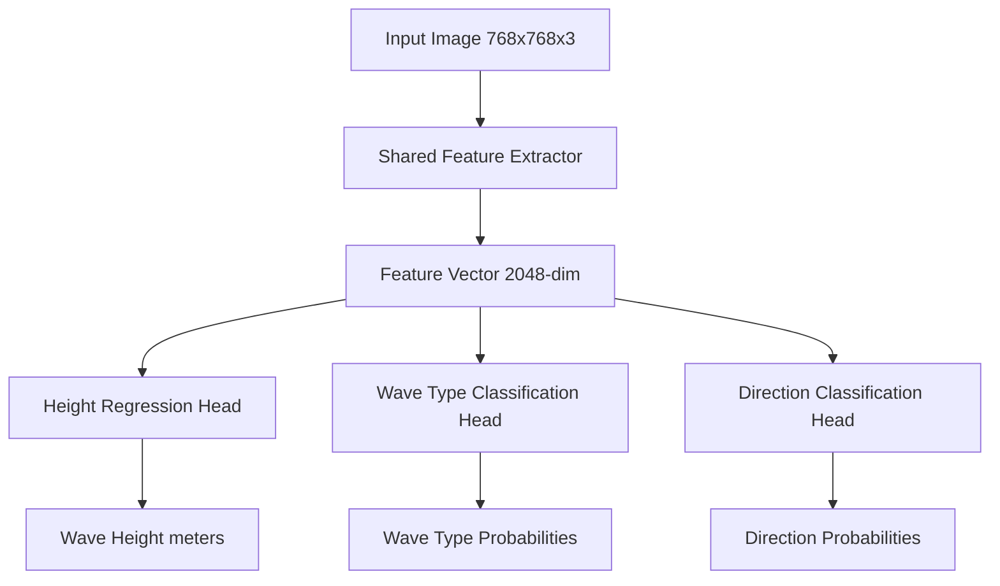
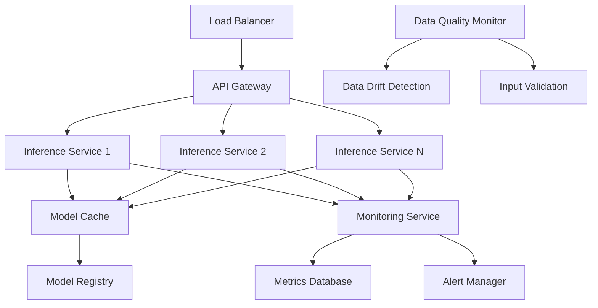

# Design Document: SwellSight Wave Analysis Model

## Overview

The SwellSight Wave Analysis Model is a multi-task deep learning system that extracts objective physical wave parameters from beach camera images. The system uses a shared backbone architecture with specialized task heads to simultaneously predict wave height (regression), breaking type (classification), and wave direction (classification). The model is trained primarily on synthetic data generated from depth maps and validated on real-world beach images.

## Architecture

### High-Level Architecture



### Model Components

**Shared Feature Extractor (Backbone)**
- Architecture: ConvNeXt-Base (chosen for optimal balance of performance and efficiency)
- Input: RGB images resized to 768x768 pixels
- Output: 2048-dimensional feature vector
- Pre-trained: ImageNet-1K weights for initialization
- Rationale: Research shows ConvNeXt matches Transformer performance with lower computational demands and performs well on diverse computer vision tasks

**Task-Specific Heads**
1. **Height Regression Head**: 2-layer MLP (2048 → 512 → 1) with ReLU activation
2. **Wave Type Head**: 2-layer MLP (2048 → 512 → 4) with softmax output
3. **Direction Head**: 2-layer MLP (2048 → 512 → 3) with softmax output

### Multi-Task Loss Function

The total loss combines three components with learnable weights:

```
L_total = w1 * L_height + w2 * L_type + w3 * L_direction

where:
- L_height = SmoothL1Loss (robust to outliers)
- L_type = CrossEntropyLoss 
- L_direction = CrossEntropyLoss
- w1, w2, w3 = learnable loss weights (initialized to 1.0)
```

## Components and Interfaces

### Data Pipeline

**MiDaSDepthExtractor**
- Uses MiDaS model from HuggingFace (DPT-Large or DPT-Hybrid) to extract depth maps from real beach images
- Processes images from data/real/images directory with corresponding labels from data/real/labels/labels.json
- Handles various image formats (JPEG, PNG) and resolutions commonly found in beach cameras
- Applies depth map post-processing, normalization, and quality validation
- Outputs depth maps in consistent format for ControlNet conditioning
- Interface:
  ```python
  class MiDaSDepthExtractor:
      def __init__(self, model_name: str = "Intel/dpt-large")
      def extract_depth(self, image_path: str) -> np.ndarray
      def batch_extract(self, image_paths: List[str]) -> List[np.ndarray]
      def validate_depth_quality(self, depth_map: np.ndarray) -> float
  ```

**ControlNetSyntheticGenerator**
- Uses Stable Diffusion with ControlNet depth conditioning to generate photorealistic synthetic beach images
- Takes MiDaS-extracted depth maps as structural guidance for image generation
- Integrates comprehensive augmentation parameter system with 10 attribute categories
- Generates multiple synthetic variants per real image with systematic parameter variation
- Preserves wave structure while creating diverse environmental conditions
- Interface:
  ```python
  class ControlNetSyntheticGenerator:
      def __init__(self, controlnet_model: str = "lllyasviel/sd-controlnet-depth")
      def generate_synthetic_image(self, depth_map: np.ndarray, 
                                 augmentation_params: AugmentationParameters,
                                 prompt: str) -> np.ndarray
      def batch_generate(self, depth_maps: List[np.ndarray],
                        param_sets: List[AugmentationParameters]) -> List[np.ndarray]
  ```

**DepthAnalyzer**
- Analyzes MiDaS-extracted depth maps to estimate wave parameters directly from depth information
- Provides alternative wave parameter estimation method for validation and comparison
- Implements depth-based wave height, breaking pattern, and direction detection algorithms
- Uses computer vision techniques including:
  - Crest detection via local maxima finding in depth gradients
  - Breaking pattern identification through depth discontinuity analysis
  - Wave direction estimation using optical flow on depth sequences
  - Confidence scoring based on depth map quality and feature consistency
- Interface:
  ```python
  class DepthAnalyzer:
      def estimate_wave_height(self, depth_map: np.ndarray) -> Tuple[float, float]  # height, confidence
      def detect_breaking_patterns(self, depth_map: np.ndarray) -> Dict[str, float]
      def analyze_wave_direction(self, depth_map: np.ndarray) -> Tuple[str, float]
      def generate_depth_features(self, depth_map: np.ndarray) -> np.ndarray
      def validate_depth_quality(self, depth_map: np.ndarray) -> float
      def extract_wave_crests(self, depth_map: np.ndarray) -> List[np.ndarray]
  ```

**AugmentationParameterSystem**
- Implements 10 comprehensive augmentation categories:
  1. **Camera View Geometry**: height (1-50m), tilt (-10° to +30°), FOV (30-120°), distance (10-500m), offset (-100m to +100m)
  2. **Wave Field Structure**: height (0.3-4.0m), wavelength (5-200m), period (3-20s), spread (0-45°), fronts (1-10)
  3. **Breaking Behavior**: type (spilling/plunging/collapsing/surging), intensity (0-1), sharpness (0-1), foam (0-100%)
  4. **Shore Interaction**: slope (1-45°), run-up (0-50m), backwash (bool), reflectivity (0-1), curvature (-0.1 to +0.1)
  5. **Water Surface Texture**: roughness (0-1), ripples (0-100 Hz), streaks (0-1), highlights (0-1), micro-foam (0-1)
  6. **Lighting and Sun Position**: elevation (0-90°), azimuth (0-360°), intensity (0-2), softness (0-1), glare (0-1)
  7. **Atmospheric Conditions**: haze (0-1), fog height (0-100m), humidity (0-1), clarity (categorical), attenuation (0-1)
  8. **Weather State**: clouds (0-100%), type (categorical), rain (bool), streaks (0-1), storm (0-1)
  9. **Optical/Sensor Artifacts**: distortion (-0.5 to +0.5), blur (0-20px), noise (0-0.1), compression (0-1), aberration (0-1)
  10. **Scene Occlusions/Noise**: people (0-20), surfboards (bool), birds (0-50), spray (0-1), blur (0-10px)
- Samples parameters from realistic distributions to ensure plausible combinations
- Records all parameter values as metadata for analysis and debugging

**HybridDataLoader**
- Manages both real images with manual labels and synthetic images with generated labels
- Maintains correspondence between real depth maps, synthetic variants, and augmentation parameters
- Applies consistent preprocessing across real and synthetic data
- Supports domain adaptation training strategies with separate real/synthetic data streams

**DatasetManager**
- Manages train/validation splits (80/20 for synthetic data)
- Provides PyTorch DataLoader with batching and shuffling
- Handles data normalization and augmentation pipelines

### Model Architecture

**WaveAnalysisModel (PyTorch nn.Module)**
```python
class WaveAnalysisModel(nn.Module):
    def __init__(self, backbone='convnext_base', num_classes_type=4, num_classes_direction=3):
        # ConvNeXt backbone + 3 task heads
        
    def forward(self, x):
        # Returns dict: {'height': tensor, 'wave_type': tensor, 'direction': tensor}
```

**MultiTaskLoss (PyTorch nn.Module)**
```python
class MultiTaskLoss(nn.Module):
    def __init__(self):
        # Learnable loss weights + individual loss functions
        
    def forward(self, predictions, targets):
        # Returns weighted combination of all losses
```

### Training Pipeline

**Trainer**
- Implements training loop with multi-task optimization
- Handles model checkpointing every 10 epochs
- Tracks separate metrics for each task
- Implements early stopping based on validation loss

**MetricsCalculator**
- Computes task-specific metrics:
  - Height: MAE, RMSE
  - Classification: Accuracy, F1-score, confusion matrices
- Generates performance reports and visualizations

### Inference System

**InferenceEngine**
- Loads trained model weights with version validation
- Preprocesses input images (resize, normalize, format conversion)
- Returns structured predictions with confidence scores and uncertainty estimates
- Handles batch processing for multiple images with optimized memory usage
- Implements request caching and result memoization for repeated queries
- Provides detailed error reporting and graceful degradation

**ModelVersionManager**
- Manages multiple model versions with semantic versioning
- Supports A/B testing between model versions
- Implements model rollback capabilities for production safety
- Tracks model performance metrics across versions
- Provides model comparison and selection utilities

**ProductionAPI**
- RESTful API with OpenAPI specification
- Request validation and sanitization
- Rate limiting and authentication
- Comprehensive logging and monitoring
- Health check endpoints for deployment orchestration
- Async processing support for high-throughput scenarios

## Data Models

### Input Data Schema
```python
@dataclass
class RealImageSample:
    image_path: str
    depth_map: np.ndarray  # MiDaS extracted depth
    manual_labels: Dict[str, Any]  # From data/real/labels/labels.json
    metadata: Dict[str, Any]  # camera params, location, timestamp

@dataclass
class AugmentationParameters:
    # Camera View Geometry
    camera_height_m: float  # 1-50m
    tilt_angle_deg: float  # -10 to +30 degrees
    horizontal_fov_deg: float  # 30-120 degrees
    distance_to_breaking_m: float  # 10-500m
    lateral_offset_m: float  # -100 to +100m
    
    # Wave Field Structure
    dominant_wave_height_m: float  # 0.3-4.0m
    wavelength_m: float  # 5-200m
    wave_period_s: float  # 3-20s
    directional_spread_deg: float  # 0-45 degrees
    visible_wave_fronts: int  # 1-10
    
    # Breaking Behavior
    breaking_type: str  # spilling, plunging, collapsing, surging
    breaker_intensity: float  # 0.0-1.0
    crest_sharpness: float  # 0.0-1.0
    foam_coverage_pct: float  # 0-100%
    
    # Shore Interaction
    beach_slope_deg: float  # 1-45 degrees
    runup_distance_m: float  # 0-50m
    backwash_visible: bool
    wet_sand_reflectivity: float  # 0.0-1.0
    shoreline_curvature: float  # -0.1 to +0.1
    
    # Water Surface Texture
    surface_roughness: float  # 0.0-1.0
    ripples_frequency_hz: float  # 0-100 Hz
    wind_streak_visibility: float  # 0.0-1.0
    specular_highlight_intensity: float  # 0.0-1.0
    micro_foam_density: float  # 0.0-1.0
    
    # Lighting and Sun Position
    sun_elevation_deg: float  # 0-90 degrees
    sun_azimuth_deg: float  # 0-360 degrees
    light_intensity: float  # 0.0-2.0
    shadow_softness: float  # 0.0-1.0
    sun_glare_probability: float  # 0.0-1.0
    
    # Atmospheric Conditions
    haze_density: float  # 0.0-1.0
    fog_layer_height_m: float  # 0-100m
    humidity_level: float  # 0.0-1.0
    sky_clarity: str  # clear, partly_cloudy, overcast, stormy
    contrast_attenuation: float  # 0.0-1.0
    
    # Weather State
    cloud_coverage_pct: float  # 0-100%
    cloud_type: str  # cumulus, stratus, cirrus, cumulonimbus
    rain_present: bool
    rain_streak_intensity: float  # 0.0-1.0
    storminess: float  # 0.0-1.0
    
    # Optical and Sensor Artifacts
    lens_distortion_coeff: float  # -0.5 to +0.5
    motion_blur_kernel_size: int  # 0-20 pixels
    sensor_noise_level: float  # 0.0-0.1
    compression_artifacts: float  # 0.0-1.0
    chromatic_aberration: float  # 0.0-1.0
    
    # Scene Occlusions and Noise Objects
    people_count: int  # 0-20
    surfboard_present: bool
    birds_count: int  # 0-50
    sea_spray_occlusion_prob: float  # 0.0-1.0
    foreground_blur_amount: int  # 0-10 pixels

@dataclass
class SyntheticSample:
    original_image_path: str  # Source real image
    synthetic_image: np.ndarray  # ControlNet generated
    depth_map: np.ndarray  # MiDaS depth from original
    augmentation_params: AugmentationParameters  # All augmentation settings
    estimated_labels: Dict[str, Any]  # Wave parameters derived from augmentation
    generation_metadata: Dict[str, Any]  # ControlNet settings, timestamps, etc.
```

### Output Schema
```python
@dataclass
class WavePrediction:
    height_meters: float
    wave_type_probs: Dict[str, float]
    direction_probs: Dict[str, float]
    confidence_scores: Dict[str, float]
```

### Model Configuration
```python
@dataclass
class ModelConfig:
    backbone: str = 'convnext_base'
    input_size: Tuple[int, int] = (768, 768)
    feature_dim: int = 2048
    hidden_dim: int = 512
    dropout_rate: float = 0.1
    learning_rate: float = 1e-4
    batch_size: int = 32
    num_epochs: int = 100
```

## Correctness Properties

*A property is a characteristic or behavior that should hold true across all valid executions of a system-essentially, a formal statement about what the system should do. Properties serve as the bridge between human-readable specifications and machine-verifiable correctness guarantees.*

After analyzing the acceptance criteria, I've identified the following testable properties. Some redundant properties have been consolidated to avoid duplication:

### Model Architecture Properties

**Property 1: Model Input/Output Consistency**
*For any* RGB image of size 768x768 pixels, the Wave_Analysis_Model should produce exactly three outputs: a height scalar, a 4-dimensional wave type probability vector, and a 3-dimensional direction probability vector
**Validates: Requirements 1.1, 1.3, 1.4, 1.5, 1.6**

**Property 2: Feature Extractor Dimensionality**
*For any* valid input image, the Feature_Extractor should output a feature vector of exactly 2048 dimensions
**Validates: Requirements 1.2**

**Property 3: Probability Vector Validity**
*For any* model output, both classification heads should produce probability vectors that sum to 1.0 (±1e-6 tolerance)
**Validates: Requirements 1.5, 1.6**

### Data Pipeline Properties

**Property 4: Ground Truth Preservation**
*For any* synthetic training sample, the extracted wave parameters should exactly match the parameters used during depth map generation
**Validates: Requirements 2.1**

**Property 5: Training Sample Format Consistency**
*For any* generated training sample, it should contain exactly four components: RGB image tensor, height float, wave type string, and direction string, all with correct data types
**Validates: Requirements 2.3**

**Property 6: Parameter Range Coverage**
*For any* batch of 1000+ synthetic samples, the height values should span the range 0.3-4.0m, and all wave types and directions should be represented
**Validates: Requirements 2.5**

**Property 7: Image Generation Validity**
*For any* depth map input, the ControlNet pipeline should produce a valid RGB image with dimensions 768x768x3 and pixel values in range [0,255]
**Validates: Requirements 2.2**

### Training Process Properties

**Property 8: Multi-Task Loss Composition**
*For any* training batch, the total loss should be computed as a weighted sum of height regression loss, wave type classification loss, and direction classification loss
**Validates: Requirements 3.1, 3.2**

**Property 9: Data Augmentation Application**
*For any* input image during training, the augmentation pipeline should apply transformations including rotation, brightness, contrast, and noise variations within specified ranges
**Validates: Requirements 3.4**

**Property 10: Checkpoint Persistence**
*For any* training run, model checkpoints should be saved every 10 epochs with complete model state and validation metrics
**Validates: Requirements 3.5**

### Inference and API Properties

**Property 11: Image Format Compatibility**
*For any* valid JPEG or PNG image file, the Inference_API should successfully load and process the image without errors
**Validates: Requirements 5.1**

**Property 12: API Response Structure**
*For any* successful inference request, the API should return a JSON response containing height prediction, wave type probabilities, direction probabilities, and confidence scores
**Validates: Requirements 5.2, 5.4**

**Property 13: Error Handling Robustness**
*For any* invalid input (corrupted image, wrong format, missing file), the API should return an appropriate error message without crashing
**Validates: Requirements 5.5**

### Evaluation System Properties

**Property 14: Metrics Computation Correctness**
*For any* set of predictions and ground truth values, the evaluation system should compute MAE, RMSE for regression and accuracy, F1-score for classification tasks using standard formulas
**Validates: Requirements 6.1, 6.2**

**Property 15: Dataset Separation**
*For any* evaluation run, metrics should be computed separately for synthetic validation data and real-world test data with no data leakage between sets
**Validates: Requirements 6.3**

### Data Management Properties

**Property 16: Dataset Split Integrity**
*For any* synthetic dataset, the train/validation split should maintain exactly 80/20 ratio with no overlap between sets
**Validates: Requirements 7.2**

**Property 17: Real Data Isolation**
*For any* real-world image, it should only appear in the test set and never be used during training or validation
**Validates: Requirements 7.3**

**Property 18: Batch Processing Consistency**
*For any* dataset, the data loader should produce batches with correct shapes, proper shuffling, and consistent preprocessing
**Validates: Requirements 7.4**

### Model Persistence Properties

**Property 19: Model Serialization Round-Trip**
*For any* trained model, saving and then loading the model should produce identical inference outputs for the same input
**Validates: Requirements 8.1, 8.3**

**Property 20: Metadata Completeness**
*For any* saved model, the checkpoint should include training date, dataset version, and performance metrics in the metadata
**Validates: Requirements 8.2**

**Property 21: Device Compatibility**
*For any* trained model, it should run successfully on both CPU and GPU devices with identical outputs (within numerical precision)
**Validates: Requirements 8.5**

### MiDaS Depth Extraction Properties

**Property 22: Depth Map Generation Consistency**
*For any* valid beach image, MiDaS should produce a depth map with same spatial dimensions and valid depth values within the range 1-100 meters
**Validates: Requirements 2.1, 2.2, 7.1**

**Property 23: Depth Quality Validation**
*For any* generated depth map, quality metrics should be within acceptable ranges (quality score > 0.3) for beach scene analysis
**Validates: Requirements 2.1, 2.2, 7.1**

**Property 24: Batch Processing Consistency**
*For any* batch of images processed by MiDaS, individual processing should produce identical results to batch processing for the same images
**Validates: Requirements 2.1, 2.2**

### ControlNet Synthetic Generation Properties

**Property 25: Synthetic Image Quality**
*For any* depth map input, ControlNet should generate valid RGB images with dimensions 768x768x3 and pixel values in range [0,255]
**Validates: Requirements 2.3, 2.4**

**Property 26: Depth Structure Preservation**
*For any* generated synthetic image, the underlying depth structure should correlate with the input depth map (correlation > 0.7)
**Validates: Requirements 2.3, 2.4**

**Property 27: Augmentation Parameter Application**
*For any* set of augmentation parameters, the generated synthetic image should reflect the specified scene characteristics (lighting, weather, wave conditions)
**Validates: Requirements 2.4, 2.5, 9.1-9.12**

### Augmentation System Properties

**Property 28: Parameter Range Validation**
*For any* generated augmentation parameters, all values should be within specified realistic ranges for each of the 10 categories
**Validates: Requirements 9.1-9.12**

**Property 29: Parameter Distribution Coverage**
*For any* batch of 1000+ parameter sets, all categories should show appropriate statistical distribution coverage across their valid ranges
**Validates: Requirements 9.1-9.12**

**Property 30: Parameter Combination Plausibility**
*For any* parameter set, the combination should represent a physically plausible beach camera scene (e.g., stormy weather correlates with high wave intensity)
**Validates: Requirements 9.1-9.12**

### Depth Analysis Properties

**Property 31: Depth-Based Height Estimation**
*For any* depth map with known wave characteristics, height estimation should be within ±0.5 meters of ground truth for waves 0.5-3.0m
**Validates: Requirements 7.1, 7.2, 7.3, 7.4**

**Property 32: Breaking Pattern Detection**
*For any* depth map showing wave breaking, the analyzer should correctly identify breaking regions with >80% precision
**Validates: Requirements 7.1, 7.2, 7.3, 7.4**

**Property 33: Direction Analysis Consistency**
*For any* depth map, wave direction analysis should produce consistent results (±10 degrees) across multiple analysis runs
**Validates: Requirements 7.1, 7.2, 7.3, 7.4**

### Production System Properties

**Property 34: Model Version Consistency**
*For any* model version, loading and inference should produce identical results across different deployment environments
**Validates: Requirements 10.1, 10.2, 11.1**

**Property 35: API Response Time**
*For any* valid inference request, the API should respond within 2 seconds on standard hardware configurations
**Validates: Requirements 5.3, 11.3**

**Property 36: Data Quality Validation**
*For any* input image, the data quality system should correctly identify corrupted or invalid images with >95% accuracy
**Validates: Requirements 12.1, 12.2**

### Integration Properties

**Property 37: Real-Synthetic Correspondence**
*For any* training sample, there should be clear traceability from real image through depth map to synthetic variants with preserved metadata
**Validates: Requirements 2.6, 2.7**

**Property 38: Augmentation Metadata Preservation**
*For any* synthetic training sample, all augmentation parameters should be preserved and accessible for analysis and debugging
**Validates: Requirements 2.6, 2.7, 9.12**

**Property 39: End-to-End Pipeline Integrity**
*For any* real beach image, the complete pipeline (MiDaS → ControlNet → Training → Inference) should produce wave parameter predictions within expected accuracy bounds
**Validates: Requirements 2.1-2.7, 4.1-4.5, 5.1-5.5**

## Error Handling

### Model-Level Error Handling
- **Input Validation**: Check image dimensions, format, and data types before processing
- **Memory Management**: Implement batch size limits to prevent OOM errors with automatic batch size reduction
- **Numerical Stability**: Use gradient clipping and proper weight initialization
- **Device Compatibility**: Graceful fallback from GPU to CPU if CUDA unavailable
- **Model Loading**: Validate model integrity and version compatibility during loading

### Data Pipeline Error Handling
- **File I/O Errors**: Robust handling of corrupted or missing image files with retry mechanisms
- **Format Validation**: Verify image formats and reject unsupported types with detailed error messages
- **Label Validation**: Check ground truth values are within expected ranges with statistical validation
- **Memory Limits**: Implement streaming data loading for large datasets with memory monitoring
- **Depth Map Quality**: Validate depth map quality and reject low-quality extractions

### Training Process Error Handling
- **Convergence Issues**: Early stopping and learning rate scheduling with convergence monitoring
- **Checkpoint Recovery**: Resume training from last valid checkpoint on failure with state validation
- **Loss Explosion**: Gradient clipping and loss value monitoring with automatic intervention
- **Resource Exhaustion**: Automatic batch size reduction on OOM with performance tracking
- **Data Quality**: Monitor training data quality and detect distribution shifts

### API Error Handling
- **Input Validation**: Comprehensive validation of API requests with detailed error responses
- **Timeout Management**: Request timeouts to prevent hanging with configurable limits
- **Resource Limits**: Rate limiting and concurrent request management with queue monitoring
- **Graceful Degradation**: Fallback responses when model unavailable with service health checks
- **Authentication**: Secure API access with proper error handling for unauthorized requests

### Production System Error Handling
- **Model Version Conflicts**: Handle version mismatches with automatic rollback capabilities
- **Deployment Failures**: Robust deployment with health checks and automatic recovery
- **Monitoring Alerts**: Comprehensive alerting for system health and performance degradation
- **Data Drift**: Detect and handle input data distribution changes with automatic retraining triggers
- **Scaling Issues**: Handle load spikes with automatic scaling and resource management

<function_calls>
<invoke name="prework">
<parameter name="featureName">wave-analysis-model

## Deployment Architecture

### Production Deployment Strategy



### Container Architecture
- **Base Image**: Python 3.9 slim with optimized PyTorch installation
- **Model Loading**: Lazy loading with memory-mapped model files
- **Resource Management**: Configurable CPU/GPU allocation with automatic scaling
- **Health Monitoring**: Liveness and readiness probes for Kubernetes deployment

### Performance Optimization
- **Model Quantization**: INT8 quantization for CPU inference acceleration
- **Batch Processing**: Dynamic batching with configurable timeout and batch size
- **Memory Management**: Gradient checkpointing and model sharding for large models
- **Caching Strategy**: Multi-level caching (Redis for results, local for models)

## Quality Assurance Framework

### Continuous Integration Pipeline
1. **Code Quality**: Automated linting, type checking, and security scanning
2. **Unit Testing**: Comprehensive test coverage with property-based testing
3. **Integration Testing**: End-to-end pipeline validation with real data samples
4. **Performance Testing**: Benchmark regression testing across model versions
5. **Model Validation**: Automated accuracy and bias testing on held-out datasets

### Production Monitoring
- **Model Performance**: Real-time accuracy tracking with statistical significance testing
- **System Health**: Resource utilization, response times, and error rates
- **Data Quality**: Input distribution monitoring and anomaly detection
- **Business Metrics**: Wave prediction accuracy correlation with ground truth measurements

### Model-Level Error Handling
- **Input Validation**: Check image dimensions, format, and data types before processing
- **Memory Management**: Implement batch size limits to prevent OOM errors
- **Numerical Stability**: Use gradient clipping and proper weight initialization
- **Device Compatibility**: Graceful fallback from GPU to CPU if CUDA unavailable

### Data Pipeline Error Handling
- **File I/O Errors**: Robust handling of corrupted or missing image files
- **Format Validation**: Verify image formats and reject unsupported types
- **Label Validation**: Check ground truth values are within expected ranges
- **Memory Limits**: Implement streaming data loading for large datasets

### Training Process Error Handling
- **Convergence Issues**: Early stopping and learning rate scheduling
- **Checkpoint Recovery**: Resume training from last valid checkpoint on failure
- **Loss Explosion**: Gradient clipping and loss value monitoring
- **Resource Exhaustion**: Automatic batch size reduction on OOM

### API Error Handling
- **Input Validation**: Comprehensive validation of API requests
- **Timeout Management**: Request timeouts to prevent hanging
- **Resource Limits**: Rate limiting and concurrent request management
- **Graceful Degradation**: Fallback responses when model unavailable

## Testing Strategy

### Dual Testing Approach
The testing strategy combines unit tests for specific functionality with property-based tests for comprehensive validation:

**Unit Tests**:
- Test specific model components (backbone, task heads, loss functions)
- Validate data loading and preprocessing pipelines
- Test API endpoints with known inputs and expected outputs
- Verify checkpoint saving/loading with specific model states
- Test error handling with deliberately invalid inputs

**Property-Based Tests**:
- Validate universal properties across randomly generated inputs
- Test model behavior with diverse synthetic wave parameters
- Verify data pipeline consistency across large sample sets
- Test API robustness with varied image formats and sizes
- Validate mathematical properties of loss functions and metrics

### Property-Based Testing Configuration
- **Framework**: Hypothesis for Python property-based testing
- **Test Iterations**: Minimum 100 iterations per property test
- **Input Generation**: Smart generators for realistic wave parameters, valid image tensors, and API requests
- **Shrinking**: Automatic reduction of failing test cases to minimal examples
- **Seed Control**: Reproducible test runs with fixed random seeds

### Test Organization
```
tests/
├── unit/
│   ├── test_model_architecture.py
│   ├── test_data_pipeline.py
│   ├── test_training_process.py
│   └── test_inference_api.py
├── property/
│   ├── test_model_properties.py
│   ├── test_data_properties.py
│   ├── test_training_properties.py
│   └── test_api_properties.py
└── integration/
    ├── test_end_to_end.py
    └── test_real_data_validation.py
```

### Test Tagging
Each property test must include a comment referencing its design document property:
```python
def test_model_output_consistency():
    """
    Feature: wave-analysis-model, Property 1: Model Input/Output Consistency
    """
```

### Performance Benchmarks
- **Training Speed**: Track epochs per hour on standard hardware
- **Inference Latency**: Measure prediction time on CPU and GPU
- **Memory Usage**: Monitor peak memory consumption during training
- **Model Size**: Track checkpoint file sizes and compression ratios

### Validation Protocols
- **Synthetic Data Validation**: Test on held-out synthetic samples
- **Real Data Validation**: Evaluate on manually labeled beach images
- **Cross-Domain Testing**: Test on images from different camera angles and lighting
- **Robustness Testing**: Evaluate performance with various image corruptions