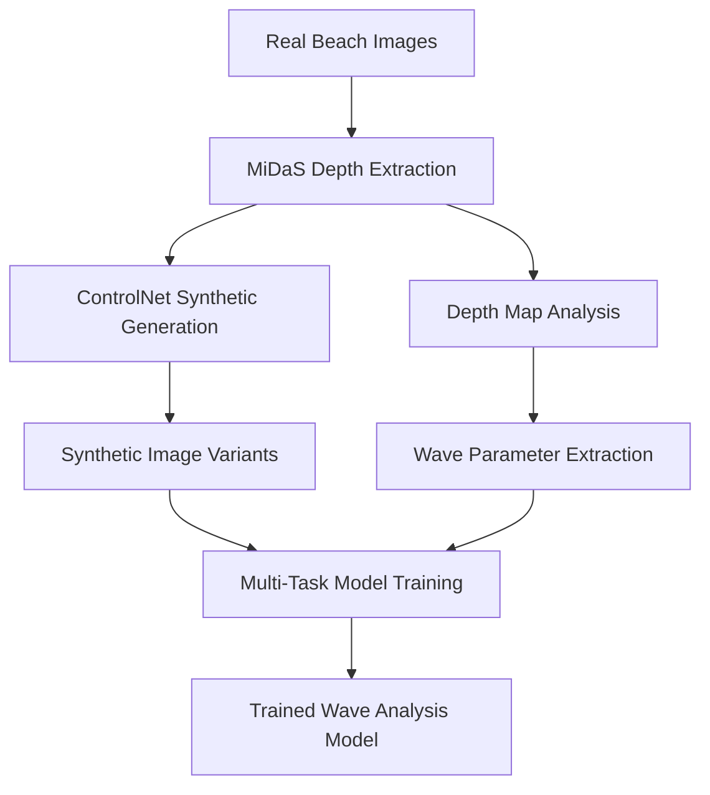

# Design Document: SwellSight Wave Analysis Model (MiDaS + ControlNet Pipeline)

## Overview

The updated SwellSight Wave Analysis Model uses a real-to-synthetic data generation pipeline that leverages MiDaS depth estimation and ControlNet image synthesis. This approach creates more realistic training data by starting with real beach camera images, extracting their depth structure, and generating diverse synthetic variants while maintaining the underlying wave geometry.

## Architecture

### High-Level Pipeline



### Pipeline Components

**1. MiDaS Depth Extraction**
- Model: Intel/dpt-large (or similar MiDaS variant)
- Input: Real beach camera images (any resolution)
- Output: High-quality depth maps
- Purpose: Extract 3D structure from real wave scenes

**2. Depth-Based Wave Analysis**
- Analyzes depth maps to extract ground truth parameters
- Height estimation from depth variation analysis
- Wave type classification from gradient patterns
- Direction determination from flow analysis

**3. ControlNet Synthetic Generation**
- Model: lllyasviel/control_v11f1p_sd15_depth
- Conditioning: MiDaS depth maps
- Output: Multiple photorealistic variants per depth map
- Prompts: Various weather, lighting, and sea conditions

**4. Multi-Task Wave Analysis Model**
- Architecture: ConvNeXt-Base backbone + 3 specialized heads
- Training: Real-to-synthetic paired data
- Tasks: Height regression, wave type classification, direction classification

## Data Pipeline Architecture

### Real Image Processing
```python
class RealImageProcessor:
    def __init__(self):
        self.midas_extractor = MiDaSDepthExtractor()
        self.wave_analyzer = DepthBasedWaveAnalyzer()
        self.controlnet_generator = ControlNetSyntheticGenerator()
    
    def process_real_image(self, image_path):
        # Extract depth map using MiDaS
        depth_map = self.midas_extractor.extract_depth(image_path)
        
        # Analyze wave parameters from depth
        wave_params = self.wave_analyzer.analyze_depth_map(depth_map)
        
        # Generate synthetic variants
        synthetic_images = self.controlnet_generator.generate_variants(depth_map)
        
        return depth_map, wave_params, synthetic_images
```

### Synthetic Data Generation
```python
class MiDaSControlNetDataset(Dataset):
    def __init__(self, real_images_dir, variants_per_image=5):
        self.real_images = list(Path(real_images_dir).glob("*.jpg"))
        self.variants_per_image = variants_per_image
        self.processor = RealImageProcessor()
    
    def __getitem__(self, idx):
        # Process real image to get depth + synthetic variants
        real_image = self.real_images[idx // self.variants_per_image]
        variant_id = idx % self.variants_per_image
        
        depth_map, wave_params, synthetic_images = self.processor.process_real_image(real_image)
        synthetic_image = synthetic_images[variant_id]
        
        return synthetic_image, wave_params
```

## Model Architecture

### Shared Backbone
- **Architecture**: ConvNeXt-Base (timm implementation)
- **Pre-training**: ImageNet-1K weights
- **Input**: 768x768 RGB images (synthetic variants)
- **Output**: 1024-dimensional feature vector

### Task-Specific Heads
1. **Height Regression Head**: 
   - Architecture: Linear(1024 → 512 → 1)
   - Loss: SmoothL1Loss (robust to outliers)
   - Target: Wave height in meters (from depth analysis)

2. **Wave Type Classification Head**:
   - Architecture: Linear(1024 → 512 → 4)
   - Classes: A-frame, Closeout, Beach Break, Point Break
   - Loss: CrossEntropyLoss
   - Target: Derived from depth gradient patterns

3. **Direction Classification Head**:
   - Architecture: Linear(1024 → 512 → 3)
   - Classes: Left, Right, Both
   - Loss: CrossEntropyLoss
   - Target: Derived from depth flow analysis

### Multi-Task Loss Function
```python
class MiDaSMultiTaskLoss(nn.Module):
    def __init__(self):
        super().__init__()
        self.height_weight = nn.Parameter(torch.tensor(1.0))
        self.type_weight = nn.Parameter(torch.tensor(1.0))
        self.direction_weight = nn.Parameter(torch.tensor(1.0))
        
        self.height_loss = nn.SmoothL1Loss()
        self.type_loss = nn.CrossEntropyLoss()
        self.direction_loss = nn.CrossEntropyLoss()
    
    def forward(self, predictions, targets):
        total_loss = (
            self.height_weight * self.height_loss(predictions['height'], targets['height']) +
            self.type_weight * self.type_loss(predictions['wave_type'], targets['wave_type']) +
            self.direction_weight * self.direction_loss(predictions['direction'], targets['direction'])
        )
        return total_loss
```

## Depth-Based Parameter Extraction

### Wave Height Estimation
- **Method**: Analyze depth variation in water regions
- **Calculation**: Standard deviation and peak-to-peak range of depth values
- **Mapping**: Heuristic scaling from depth variation to physical height
- **Validation**: Calibration against manual measurements

### Wave Type Classification
- **Method**: Gradient pattern analysis of depth maps
- **Features**: Connected components of high-gradient regions
- **Heuristics**:
  - Few large regions → Closeout
  - Moderate regions → A-frame
  - Many small regions → Beach break
  - Consistent patterns → Point break

### Direction Determination
- **Method**: Horizontal flow analysis from depth gradients
- **Calculation**: Compare left vs right region gradient flows
- **Classification**:
  - Similar flows → Both directions
  - Left > Right → Left breaking
  - Right > Left → Right breaking

## Training Strategy

### Data Generation Pipeline
1. **Real Image Collection**: Gather diverse beach camera images
2. **Batch Processing**: Process real images through MiDaS + ControlNet pipeline
3. **Quality Filtering**: Remove low-quality depth maps or failed generations
4. **Augmentation**: Apply standard image augmentations to synthetic variants
5. **Dataset Creation**: Create train/validation splits maintaining real image separation

### Training Configuration
- **Batch Size**: 16 (optimized for Colab GPU memory)
- **Learning Rate**: 1e-4 with cosine annealing
- **Epochs**: 100 with early stopping
- **Optimizer**: AdamW with weight decay
- **Mixed Precision**: Enabled for faster training

### Validation Strategy
- **Synthetic Validation**: Test on held-out synthetic variants
- **Real Image Testing**: Evaluate on original real images (not used in training)
- **Cross-Domain Validation**: Test on images from different locations/cameras

## Advantages of MiDaS + ControlNet Approach

### Improved Realism
- **Real Wave Structures**: Training data based on actual wave geometry
- **Diverse Conditions**: Multiple synthetic variants per real scene
- **Better Domain Transfer**: Reduced gap between training and inference

### Scalable Data Generation
- **Automated Pipeline**: Minimal manual labeling required
- **Quality Control**: MiDaS provides consistent depth estimation
- **Flexible Generation**: Easy to create variants with different conditions

### Robust Ground Truth
- **Depth-Based Labels**: More objective than visual assessment
- **Consistent Analysis**: Automated parameter extraction
- **Calibratable**: Can be tuned with real measurements

## Implementation Considerations

### Memory Management
- **Model Offloading**: Use CPU offloading for ControlNet to manage GPU memory
- **Batch Processing**: Process real images in batches to avoid memory issues
- **Caching**: Save processed depth maps and synthetic variants to disk

### Quality Assurance
- **Depth Map Validation**: Filter out poor quality depth extractions
- **Generation Filtering**: Remove failed or low-quality synthetic images
- **Parameter Validation**: Ensure extracted parameters are within realistic ranges

### Performance Optimization
- **Mixed Precision**: Use FP16 for faster training and inference
- **XFormers**: Enable memory-efficient attention for ControlNet
- **Gradient Checkpointing**: Reduce memory usage during training